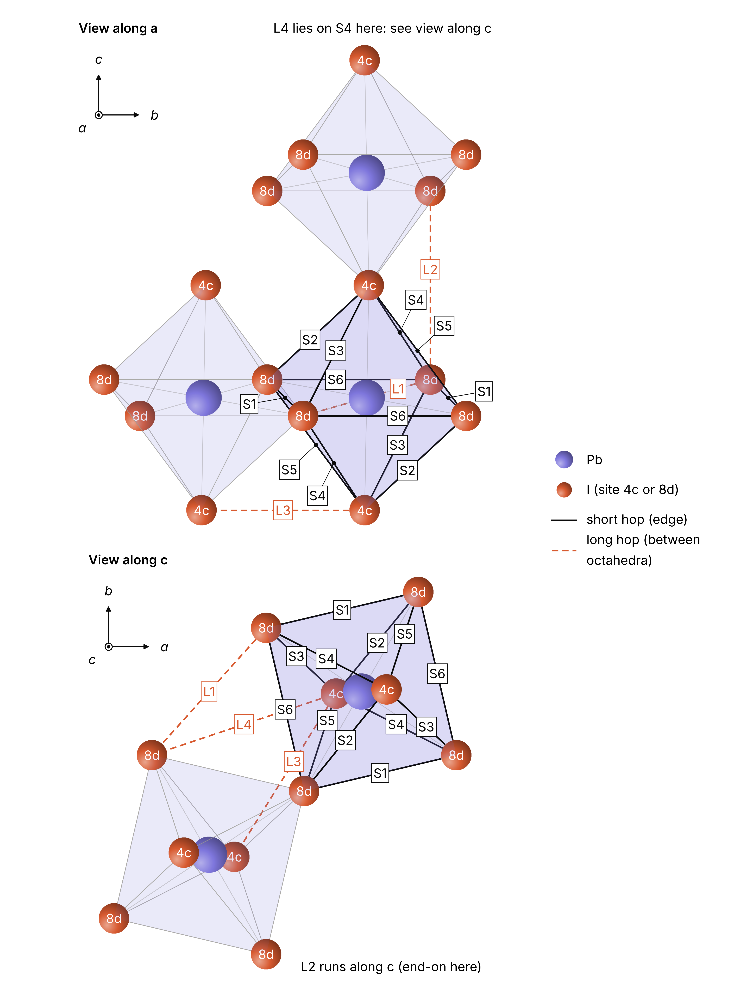

# gamma-CsPbI3-defects

First-principles study of iodine defect migration in orthorhombic γ-CsPbI₃, using Quantum ESPRESSO.

This repository holds the inputs, scripts and text outputs. Scratch data (wavefunctions, charge densities) is not tracked.

## Status

| Stage | State |
|---|---|
| Convergence test, soft and tight relaxation of the unit cell | Done |
| Cluster setup; `neb.x` and `pp.x` compiled (Quantum ESPRESSO 6.5) | Done |
| Perfect supercell and vacancy relaxations (5 jobs) | On the cluster |
| Set of distinct bulk hops | Settled: 10 (6 short, 4 long) |
| Hop end points and NEB inputs (`build_neb.py`) | To do |
| Bulk barriers (NEB) | To do |
| CsI-terminated slab: vacancies and barriers against depth | To do |

## The material: γ-CsPbI₃

### What it is

CsPbI₃ is a halide perovskite with the formula ABX₃. Each Pb atom sits at the centre of an octahedron of six iodine atoms. The octahedra share corners and form a three-dimensional network, and the Cs atoms fill the cavities between them.

The compound exists in several phases:

| Phase | Structure | Notes |
|---|---|---|
| α | Cubic perovskite, octahedra not tilted | Stable only at high temperature |
| β | Tetragonal perovskite, tilted about one axis | Intermediate, on cooling from α |
| γ | Orthorhombic perovskite, tilted about all three axes | The black perovskite phase found at room temperature; metastable |
| δ | Orthorhombic, not a perovskite (yellow) | The stable phase at room temperature; poor light absorber |

The γ phase is the one used in solar cells and light emitters, with a band gap of about 1.7 eV.

### Why γ and not the cubic α phase

At zero temperature the cubic structure is not a minimum of the energy: the octahedra lower their energy by tilting. A relaxation without thermal motion, such as the calculations here, therefore belongs to the γ structure. It is also the perovskite phase present in devices at room temperature.

### The structure


The figure is drawn from the soft-relaxed structure in `final/`; the tight relaxation changes it by less than 0.03 Å, which is not visible at this scale. The top view shows one layer of octahedra (Pb with its four in-plane iodine atoms) and the Cs atoms above it; the octahedra are rotated about c, in opposite senses for neighbours. The side view shows one sheet of octahedra seen along the in-plane diagonal; the Pb–I–Pb links along c are bent instead of straight.

| Property | Value (this work, PBEsol) |
|---|---|
| Space group | Pnma (No. 62), written here in the Pbnm setting with c as the long axis |
| Atoms per unit cell | 20 (4 Cs, 4 Pb, 12 I) |
| Lattice parameters | a = 8.362 Å, b = 8.961 Å, c = 12.350 Å |
| Pb–I bond lengths | 3.17 to 3.19 Å |
| Pb–I–Pb angles | 148° (equatorial) and 155° (apical); 180° in the cubic phase |
| Iodine sites | 4 apical (linking octahedra along c) and 8 equatorial (linking them within the ab plane) |

The tilting is what makes the two iodine sites different, and it is the reason the defect study below treats apical and equatorial positions separately.

## Defect study: what we are going to do

**Scope:** iodine vacancies only, in the bulk and at the CsI-terminated (001) surface.

### The two iodine sites


Each Pb sits at the centre of an octahedron of six iodines. Because the octahedra are tilted, the six are not all equivalent:

- **Apical (4c)**: the two above and below Pb, along c, in the CsI layers.
- **Equatorial (8d)**: the four around Pb, in the PbI₂ layers.

### Questions

1. Which site does the vacancy prefer, and by how much?
2. What are the barriers of the distinct hops in the bulk?
3. How do site energies and barriers change layer by layer below the CsI-terminated surface?

### Steps

| Step | Calculation | Result |
|---|---|---|
| 1 | Tight relaxation of the 20-atom cell | Reference lattice. **Done** |
| 2 | Perfect 2×2×2 supercell (160 atoms) | Energy reference |
| 3 | 4c and 8d vacancy, charge +1 and neutral | Site energy difference; charge state compared with paper A |
| 4 | NEB for the 10 distinct bulk hops | Bulk barriers; validation against paper A |
| 5 | CsI-terminated (001) slab: build and convergence | Slab whose middle reproduces the bulk |
| 6 | Vacancies at increasing depth | Site energy against depth |
| 7 | NEB at increasing depth | Barriers against depth, converging to step 4 |

One vacancy per supercell; the cell is fixed in all defect calculations.

### Bulk (steps 2 to 4)

**Validation targets from paper A** (same material, functional and supercell):

| Quantity | Paper A | Our check |
|---|---|---|
| Vacancy site energy, 4c minus 8d | about +0.03 eV | Step 3, both charge states |
| Barrier 8d to 8d | 0.34 eV | Step 4 |
| Barrier 8d to 4c (average of both directions) | 0.35 eV | Step 4 |
| Barrier 4c to 4c (long jump) | about 0.77 eV | Step 4 |

Paper A does not state its charge state; whichever of ours reproduces these numbers indicates which one they used.

**Hop set.** All octahedra are equivalent (Pb on Wyckoff site 4b), and Pb is an inversion centre, so the 12 edges of one octahedron give **6 short hops** (S1–S6). Hops between corner-sharing octahedra give **4 long hops** (L1–L4).



| Hop | Ends | Length (Å) | | Hop | Ends | Length (Å) |
|---|---|---|---|---|---|---|
| S1 | 8d–8d | 4.41 | | L1 | 8d–8d | 4.80 |
| S2 | 4c–8d | 4.43 | | L2 | 8d–8d | 5.18 |
| S3 | 4c–8d | 4.45 | | L3 | 4c–4c | 5.28 |
| S4 | 4c–8d | 4.53 | | L4 | 4c–8d | 5.93 |
| S5 | 4c–8d | 4.56 | | | | |
| S6 | 8d–8d | 4.60 | | | | |

Lengths from the tight-relaxed cell. One vacancy per site type is enough in the bulk. Each 4c–8d NEB gives both directions.

**NEB settings**

| Setting | Choice |
|---|---|
| Images | 7 for the first trial, more if the profile is not smooth |
| Climbing image | On, after the path has roughly converged |
| Path force limit | 0.05 eV/Å |
| Reported value | Forward and backward barriers, and their average |
| Parallelisation | One image per node (`-ni`) |

**Checks**

- Neutral vacancy: total magnetisation about 1 μB per cell.
- Each NEB end point matches the energy of the corresponding relaxed vacancy within a few meV.

### Slab (steps 5 to 7)

**Geometry**

| Item | Choice | Reason |
|---|---|---|
| Surface | (001), perpendicular to c, CsI-terminated on both faces | Symmetric slab; CsI and PbI₂ layers alternate, 3.09 Å apart |
| In-plane cell | 2 × 2 of the tight-relaxed cell, lattice at bulk values | Same in-plane defect spacing as the bulk supercell |
| Thickness | 11 layers (216 atoms); test 15 layers (296 atoms) | The middle layers must reproduce the bulk |
| Fixed layers | None | Frozen layers are a suspected cause of paper B's non-converging barriers |
| Vacuum | 15 to 20 Å, tested | |
| k-mesh | 2 × 2 × 1 | Same in-plane sampling as the bulk supercell |

**Symmetry at the surface.** The slab keeps only the identity and the b-glide. The inversion is lost, so the parallel-edge pairs split: each PbI₂ layer has **12 distinct short hops** (one octahedron per layer is enough, the b-glide maps it onto the other), and the long hops roughly double. In each PbI₂ layer the 8d sites above and below the Pb plane also become distinct. Distinct sites and hops are confirmed with spglib on the relaxed slab.

**What is computed**

- Vacancy site energy in every layer of the top half, relative to the middle layer. μ_I, band edges and charge corrections cancel.
- All hops in the top one or two layers. Deeper, a few former twin pairs (for example the two S1 edges), until they merge back to the bulk value within about 0.02 eV.
- Neutral vacancy first. Consistency test: its formation energy in the middle layer, relative to the perfect slab, matches the bulk value of step 3.

**Convergence tests:** clean-slab surface energy against thickness; vacancy site energy and one barrier in the middle layer against the bulk; the same in the 15-layer slab.

**Cost.** A 216-atom slab is about 1.4 times the supercell. Node requests will be planned from the timing of the supercell jobs.

### Where this sits in the literature

Details and numbers are in `Literature Reviews.md`.

| Paper | What it did | What it leaves open |
|---|---|---|
| A. Arber et al., Chem. Mater. 37, 4416 (2025) | Bulk γ-CsPbI₃: iodine vacancy barriers 0.34 eV (8d-8d), 0.35 eV (8d-4c), about 0.77 eV (4c-4c), PBEsol, 2×2×2 supercell | No surfaces; one barrier per path type; charge state not stated |
| B. Biega and Leppert, J. Phys.: Energy 3, 034017 (2021) | Cubic CsPbBr₃ slabs: the long axial-to-axial barrier is about half the bulk value at the surface | Edge hops not computed; frozen bottom layers; barriers never return to the bulk value |
| C. Ahmad et al., Phys. Rev. Materials 8, 125402 (2024) | Orthorhombic CsPbI₃ 17-layer slabs: vacancy formation energies against depth | No barriers; slab interior differs from its bulk reference by 0.05 to 0.66 eV |

**The aim:** symmetry-resolved vacancy barriers in γ-CsPbI₃, in the bulk and layer by layer below the CsI-terminated surface, in a slab whose interior reproduces the bulk.

**Not in the current scope:** interstitials, PbI₂ termination and other facets, a machine-learned potential, absolute formation energies against μ_I and E_F, spin-orbit coupling.

## File structure

```
.
├── README.md                    this file
├── LICENSE                      licence for the repository
│
├── gamma_CsPbI3_vcrelax.in      base input: experimental γ-CsPbI₃ cell (20 atoms) and settings
│
├── kconv.sh                     runs the convergence test
├── conv/                        its inputs and outputs, one pair per setting
├── conv_summary.txt             energies from the convergence test
│
├── relax2stage.sh               runs the two-stage variable-cell relaxation
├── stage1_k332/                 stage 1: relaxation at the coarse 3×3×2 k-mesh
├── stage2_k443/                 stage 2: relaxation at the converged 4×4×3 k-mesh
├── final/                       the relaxed structure, ready to use
├── relax_summary.txt            report of the relaxation
│
├── build_defects.py             builds the supercell and vacancy inputs (vacancies only)
├── defects/                     everything that script wrote, and the cluster job script
│
└── assets/                      figures used in this README
```

### Top-level files

| File | Purpose |
|---|---|
| `gamma_CsPbI3_vcrelax.in` | Starting point for everything. Holds the experimental room-temperature structure (Sutton et al., ACS Energy Lett. 2018) and the calculation settings. Both shell scripts read it and neither changes it. |
| `kconv.sh` | Makes copies of the base input as single-point calculations with different k-meshes and cutoffs, runs them, and prints the energy per atom for each. |
| `conv_summary.txt` | The table printed by `kconv.sh`. |
| `relax2stage.sh` | Relaxes the cell and atoms in two stages (coarse mesh, then converged mesh), exports the result to `final/`, and writes `relax_summary.txt`. |
| `relax_summary.txt` | Energies, pressure, forces and timing for each stage; lattice parameters compared with experiment; Pb–I–Pb angles before and after. |
| `build_defects.py` | Reads a relaxed unit cell and writes the perfect-supercell and vacancy inputs. Builds vacancies only; hop end points will come from a separate script, `build_neb.py` (planned). Does no physics calculation itself. |

### Folders

| Folder | Contents |
|---|---|
| `conv/` | `k221`, `k332`, `k443`, `k554`, `k664`: k-mesh series at 50 Ry. `e40` to `e80`: cutoff series at 4×4×3. Each has an `.in` and an `.out`. |
| `stage1_k332/` | `vcrelax.in` and `vcrelax.out` for stage 1. The output contains every geometry step. |
| `stage2_k443/` | The same for stage 2, which started from the stage 1 result. |
| `final/` | `gamma_CsPbI3_relaxed_scf.in`: complete input with the relaxed structure. `structure_blocks.txt`: cell and positions only. `gamma_CsPbI3_relaxed.cif`: for viewing. |
| `defects/` | See below. |
| `assets/` | `gamma_CsPbI3_lattice_tilted_octahedra.png`: the relaxed lattice. `iodine_vacancy_sites_apical_vs_equatorial.png`: the two vacancy sites. `octahedra_hops.png` (and `.pdf`): the 10 distinct hops. |

### Inside `defects/`

```
defects/
├── sites_report.txt             which atoms were removed
├── unitcell_tight/
│   ├── unit_tight_relaxed.in    the tight-relaxed 20-atom cell; everything below is built from it
│   ├── vcrelax.out              output of the tight relaxation
│   ├── vcrelax.in               tight-relaxation input, restarting from the relaxed cell
│   └── run_qe.pbs               PBS job script for the cluster queue
├── pristine_222/relax.in        perfect 2×2×2 supercell (160 atoms), the energy reference
├── q+1/                         defects with charge +1
│   ├── vac_I_apical/relax.in        vacancy on an apical iodine site
│   └── vac_I_equatorial/relax.in    vacancy on an equatorial iodine site
└── q0/                          the same two vacancies, neutral and spin-polarised
    ├── vac_I_apical/relax.in
    └── vac_I_equatorial/relax.in
```

Every input has a `.cif` beside it for viewing. Hop end points and NEB inputs are not built yet; they will come from `build_neb.py`.

`run_qe.pbs` loads the modules and runs `pw.x` on one 40-core node. It runs in the folder it is submitted from. Its defaults suit the unit cell; for a supercell, give the input name and two k-point pools: `qsub -N pristine -v INPUT=relax.in,NK=2 <path>/run_qe.pbs`.

Apical iodine links two Pb atoms along the long c axis. Equatorial iodine lies in the Pb–I plane. The two are different sites in the γ phase because of the octahedral tilting.

## Settings

| Item | Value |
|---|---|
| Code | Quantum ESPRESSO `pw.x`: version 7.6 on the laptop (convergence test, soft relaxation), version 6.5 on the cluster (tight relaxation and all defect calculations) |
| Functional | PBEsol |
| Spin-orbit coupling | Not included (scalar-relativistic pseudopotentials) |
| Dispersion correction | None |
| Pseudopotentials | SSSP 1.3.0 PBEsol efficiency |
| Plane-wave cutoff | 60 Ry (density 480 Ry) |
| k-mesh, 20-atom cell | 4×4×3 |
| k-mesh, 160-atom supercell | 2×2×2 |

Pseudopotential files:

| Element | File |
|---|---|
| Cs | `cs_pbesol_v1.uspp.F.UPF` |
| Pb | `Pb.pbesol-dn-kjpaw_psl.0.2.2.UPF` |
| I | `I.pbesol-n-kjpaw_psl.0.2.UPF` |

## Results so far

### Convergence

| k-mesh (50 Ry) | Energy above 6×6×4 (meV/atom) |
|---|---|
| 2×2×1 | 45.46 |
| 3×3×2 | 2.52 |
| 4×4×3 | 0.23 |
| 5×5×4 | 0.004 |

| Cutoff (4×4×3) | Energy above 80 Ry (meV/atom) | Pressure (kbar) |
|---|---|---|
| 40 Ry | 5.83 | −1.89 |
| 50 Ry | 3.29 | −1.57 |
| 60 Ry | 0.86 | −1.48 |
| 70 Ry | 0.40 | −1.35 |
| 80 Ry | 0 | −1.39 |

### Relaxed unit cell

| | a (Å) | b (Å) | c (Å) | Volume (ų) |
|---|---|---|---|---|
| Experiment, 293 K | 8.5766 | 8.8561 | 12.4722 | 947.33 |
| Soft relaxation | 8.3776 | 8.9330 | 12.3518 | 924.38 |
| **Tight relaxation** | **8.3620** | **8.9607** | **12.3503** | **925.41** |
| Tight vs soft | −0.19% | +0.31% | −0.01% | +0.11% |
| Tight vs experiment | −2.50% | +1.18% | −0.98% | −2.31% |

| | Pb–I–Pb angles | Pb–I bond lengths (Å) |
|---|---|---|
| Experiment, 293 K | 150.84° to 160.63° | 3.148 to 3.221 |
| Soft relaxation | 148.09° to 153.54° | 3.172 to 3.188 |
| **Tight relaxation** | **148.19° and 154.54°** | **3.165 to 3.190** |

| | Soft relaxation | Tight relaxation |
|---|---|---|
| Force limit (largest component) | 0.026 eV/Å (10⁻³ Ry/Bohr) | 0.010 eV/Å (4×10⁻⁴ Ry/Bohr) |
| Pressure limit | 0.5 kbar | 0.2 kbar |
| Final largest force component | | 0.0047 eV/Å (1.8×10⁻⁴ Ry/Bohr) |
| Final pressure | −0.04 kbar | −0.13 kbar |
| Steps and time | 37 + 3 evaluations, 16 h 24 min on a 6-core laptop | 14 steps, 1 h 32 min on one 40-core node |
| Code | Quantum ESPRESSO 7.6 | Quantum ESPRESSO 6.5 |

The tight relaxation lowered the energy by 1.9 meV per 20-atom cell. The volume and c hardly changed, but a shortened and b lengthened by 0.2 to 0.3%: the cell is very soft against exchanging a for b, which goes with a small change in octahedral tilt. Run on the soft-relaxed structure, the two code versions gave the same total force to six decimal places.

The defect calculations use the tight-relaxed cell.

## How to reproduce

```bash
# 1. convergence test
bash kconv.sh | tee conv_summary.txt

# 2. two-stage relaxation
bash relax2stage.sh

# 3. defect inputs
python3 build_defects.py defects/unitcell_tight/unit_tight_relaxed.in --pseudo-dir /path/to/pseudo
```

Set `PW` (path to `pw.x`) and `NP` (number of MPI processes) at the top of each shell script. Set `pseudo_dir` in `gamma_CsPbI3_vcrelax.in`. `build_defects.py` needs Python 3 with NumPy and ASE.

## Not tracked

Listed in `.gitignore`:

- `tmp/` and `*.save/`: Quantum ESPRESSO scratch data
- `*.wfc*`, `*.xml`: wavefunctions and data files
- `backup/`, `*:Zone.Identifier`, `__pycache__/`

## Next steps

1. Finish the five supercell relaxations; check the k-mesh, energies and the neutral magnetisation.
2. Compare the 4c and 8d vacancy energies with paper A (about +0.03 eV) for both charge states.
3. Write `build_neb.py` (end points for S1–S6 and L1–L4); trial NEB for one 8d-8d hop against 0.34 eV, then the rest.
4. Build the CsI-terminated slab and run the convergence tests before any defect in it.
