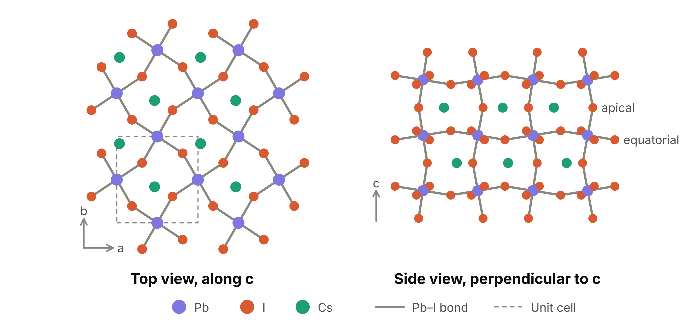
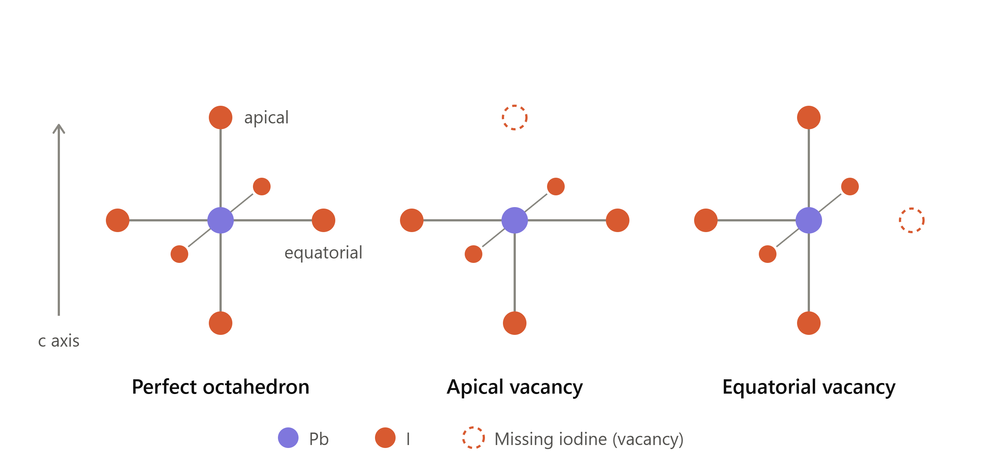

# gamma-CsPbI3-defects

First-principles study of iodine defect migration in orthorhombic γ-CsPbI₃, using Quantum ESPRESSO.

This repository holds the inputs, scripts and text outputs. Scratch data (wavefunctions, charge densities) is not tracked.

## Status

| Stage | State |
|---|---|
| Convergence test (k-points, cutoff) | Done |
| Soft relaxation of the 20-atom unit cell | Done |
| Cluster setup (job script, pseudopotentials, modules) | Done |
| Tight relaxation of the unit cell | Done |
| Perfect supercell and vacancy inputs | Built from the tight-relaxed cell |
| Perfect supercell and vacancy relaxations (5 jobs) | On the cluster |
| Vacancy hop inputs | To be built once the set of distinct hops is settled |
| `neb.x` and `pp.x` on the cluster | Done: Quantum ESPRESSO 6.5 compiled in the home folder with the Intel 2020 compilers |
| Migration barriers (NEB) | To do |
| Interstitial, surface slab, machine-learned potential | Later stages |
| Equilibrium vacancy profile against depth (analysis) | Planned, after the slab stage |

## The material: γ-CsPbI₃

### What it is

CsPbI₃ is a halide perovskite with the formula ABX₃. Each Pb atom sits at the centre of an octahedron of six iodine atoms. The octahedra share corners and form a three-dimensional network, and the Cs atoms fill the cavities between them.

The compound exists in several phases:

| Phase | Structure | Notes |
|---|---|---|
| α | Cubic perovskite, octahedra not tilted | Stable only at high temperature |
| β | Tetragonal perovskite, tilted about one axis | Intermediate, on cooling from α |
| γ | Orthorhombic perovskite, tilted about all three axes | The black perovskite phase found at room temperature; metastable |
| δ | Orthorhombic, not a perovskite (yellow) | The stable phase at room temperature; poor light absorber |

The γ phase is the one used in solar cells and light emitters, with a band gap of about 1.7 eV.

### Why γ and not the cubic α phase

At zero temperature the cubic structure is not a minimum of the energy: the octahedra lower their energy by tilting. A relaxation without thermal motion, such as the calculations here, therefore belongs to the γ structure. It is also the perovskite phase present in devices at room temperature.

### The structure



The figure is drawn from the soft-relaxed structure in `final/`; the tight relaxation changes it by less than 0.03 Å, which is not visible at this scale. The top view shows one layer of octahedra (Pb with its four in-plane iodine atoms) and the Cs atoms above it; the octahedra are rotated about c, in opposite senses for neighbours. The side view shows one sheet of octahedra seen along the in-plane diagonal; the Pb–I–Pb links along c are bent instead of straight.

| Property | Value (this work, PBEsol) |
|---|---|
| Space group | Pnma (No. 62), written here in the Pbnm setting with c as the long axis |
| Atoms per unit cell | 20 (4 Cs, 4 Pb, 12 I) |
| Lattice parameters | a = 8.362 Å, b = 8.961 Å, c = 12.350 Å |
| Pb–I bond lengths | 3.17 to 3.19 Å |
| Pb–I–Pb angles | 148° (equatorial) and 155° (apical); 180° in the cubic phase |
| Iodine sites | 4 apical (linking octahedra along c) and 8 equatorial (linking them within the ab plane) |

The tilting is what makes the two iodine sites different, and it is the reason the defect study below treats apical and equatorial positions separately.

## Defect study: what we are going to do

### The two iodine sites



Each Pb atom sits at the centre of an octahedron of six iodine atoms. In γ-CsPbI₃ the octahedra are tilted, so the six are not all equivalent:

- **Apical** iodine: the two above and below Pb, along the c axis.
- **Equatorial** iodine: the four around Pb, in the plane perpendicular to c.

Removing one iodine leaves a vacancy. Because the two sites are different, an apical vacancy and an equatorial vacancy can have different energies, and a vacancy can move by two kinds of nearest-neighbour hop along an octahedron edge, each about 4.4 to 4.6 Å long: apical ↔ equatorial and equatorial ↔ equatorial. The tilting splits each kind into several hops of slightly different length; which of these are truly distinct is still to be settled.

### Questions

1. Which site does the vacancy prefer, and by how much?
2. How high is the energy barrier for each kind of hop? The lowest barriers set how fast iodine moves through the crystal.
3. Do the answers change close to a surface, layer by layer?
4. Under given growth conditions, how many vacancies sit at each depth, and how fast do they get there?

### Steps

| Step | Calculation | Result |
|---|---|---|
| 1 | Tight relaxation of the 20-atom cell | Reference lattice. **Done** |
| 2 | Perfect 2×2×2 supercell (160 atoms), atoms relaxed at fixed cell | Energy reference; check of the k-mesh choice |
| 3 | One 4c (apical) or one 8d (equatorial) vacancy, charge +1 and neutral | Site energy difference; charge-state comparison with paper A |
| 4 | End points and NEB for every distinct bulk hop | Bulk barriers: validation against paper A, plus the 8d-4c variants |
| 5 | Iodine interstitial | Later stage |
| 6 | CsI-terminated (001) slab: vacancies and hops at increasing depth | Site energies and barriers against depth, converging to the bulk values of steps 3 and 4 |
| 7 | Machine-learned interatomic potential trained on steps 2 to 6 | Hop rates at finite temperature, larger cells, longer times |
| 8 | Analysis only: equilibrium vacancy profile (see below) | Concentration against depth, μ_I and E_F |

One defect is placed in each supercell. The cell is kept fixed in all defect calculations, so every energy is compared with the same perfect supercell.

### Design of the bulk stage (steps 2 to 4)

**Validation targets from paper A** (same material, functional and supercell):

| Quantity | Paper A | Our check |
|---|---|---|
| Vacancy site energy, 4c minus 8d | about +0.03 eV | Step 3, both charge states |
| Barrier 8d to 8d | 0.34 eV | Step 4 |
| Barrier 8d to 4c (average of both directions) | 0.35 eV | Step 4 |
| Barrier 4c to 4c (long jump) | about 0.77 eV | Step 4 |

Paper A does not state its charge state. Whichever of our two charge states reproduces these numbers indicates which one they used.

**Hop set.** Every iodine shares an octahedron edge with 8 neighbours about 4.4 to 4.6 Å away. From a 4c site all 8 are 8d sites; from an 8d site, 4 are 4c and 4 are 8d. Hops are grouped by symmetry, not by length alone: the 4c site lies on a mirror plane, so its 8 neighbours form at most 4 distinct 8d-4c hops, two of which have nearly equal length (4.55 Å). Expected set:

| Type | Distinct hops | Lengths (soft-relaxed cell) |
|---|---|---|
| 8d to 8d | 2 | 4.42, 4.59 Å |
| 8d to 4c | 3 or 4 | 4.44, 4.45, 4.55 Å |
| 4c to 4c (long jump, not along an edge) | 1 | about 6 Å |

End points that relax to the same energy within a few meV are treated as one hop.

**NEB settings**

| Setting | Choice | Reason |
|---|---|---|
| Images | 7 for the first trial, more if the profile is not smooth | Paper A used about 9 to 11; paper B only 3 |
| Climbing image | On, after the path has roughly converged | Locates the saddle point exactly |
| Path force limit | 0.05 eV/Å | Barriers converge long before the path does |
| Reported value | Forward and backward barriers, and their average | Paper A reports the average |
| Parallelisation | One image per node (`-ni`) | Images are independent within each step |

**Checks**

- Neutral vacancy: total magnetisation about 1 μB per cell, otherwise the result is invalid.
- Each hop's final state must match the energy of the corresponding vacancy within a few meV.
- Optional: one +1 structure with spin polarisation (expect zero magnetisation, unchanged energy); one spin-orbit single point on the two +1 vacancies.

### Design of the slab stage (step 6)

The two earlier surface studies did not show their slab interior returning to bulk values (see the literature section). The slab here is built so that it can.

**Geometry**

| Item | Choice | Reason |
|---|---|---|
| Surface | (001), the plane perpendicular to c | Layers alternate CsI (containing 4c iodine) and PbI₂ (containing 8d iodine), 3.09 Å apart |
| Termination | CsI on both faces first; PbI₂ later | Symmetric slab; both terminations were found to differ in paper B |
| In-plane cell | 2 × 2 of the tight-relaxed cell (16.72 × 17.92 Å), lattice held at the bulk values | Same defect-to-image distance in plane as the bulk supercell; paper B showed a 2 × 1 cell distorts the surface |
| Thickness | Start with 5 PbI₂ and 6 CsI layers (11 layers, about 31 Å, 216 atoms); test 7 PbI₂ layers (15 layers, about 43 Å, 296 atoms) | The middle layers must reproduce the bulk |
| Fixed layers | None: symmetric slab, all atoms free | Paper B's frozen bottom layers are a suspected cause of its non-converging barriers |
| Vacuum | 15 to 20 Å, tested | Charged slabs are sensitive to vacuum size |
| k-mesh | 2 × 2 × 1 | Same in-plane sampling as the bulk supercell |
| Defects | In the top half only; the middle layer serves as the bulk-like reference inside the slab | Uses the slab symmetry |

**What is computed at each depth**

| Depth | Site energies | Hops |
|---|---|---|
| CsI layer 0 (surface), 1, 2 | 4c vacancy | 4c-4c within the layer |
| PbI₂ layer 1, 2, 3 | 8d vacancy | 8d-8d within the layer |
| Between neighbouring layers | | 8d-4c, both towards and away from the surface |

Near a surface the two directions of an 8d-4c hop are no longer equivalent. The difference between them is a direct measure of the drift of vacancies towards or away from the surface.

**Convergence tests** (each reported as a figure or table)

1. Clean slab: surface energy against thickness.
2. Vacancy site energy and one barrier in the middle layer, against the bulk values of steps 3 and 4.
3. The same in the thicker slab.
4. For the charged vacancy: one barrier at two vacuum sizes.
5. Neutral and +1 vacancy in the middle layer side by side. If the neutral one matches the bulk and the +1 does not, the mismatch is in how the charge is referenced, not in the atoms.

**Cost.** A 216-atom slab is about 1.4 times the supercell; a 296-atom slab nearly twice. NEB at these sizes will need several nodes per job, and is where the machine-learned potential of step 7 starts to pay off. The node request will be planned once the time per step of the supercell jobs is known.

### Planned analysis: equilibrium vacancy profile near the surface (step 8)

The idea is a "phase diagram" for the vacancy: how likely it is to form, as a function of the conditions and of the depth below the surface.

**Three variables**

| Variable | Kind | Set by |
|---|---|---|
| μ_I, chemical potential of iodine | Condition | How the film was made and what surrounds it (iodine-rich or iodine-poor) |
| E_F, Fermi level | Condition | Doping, contacts and the overall charge balance |
| Depth z | Position | Where in the film one looks |

**Formation energy** of a vacancy with charge q in the layer at depth z:

    Q(z, μ_I, E_F) = E_defect(z) − E_perfect + μ_I + q·E_F + corrections
                   = Q₀(z) + μ_I + q·E_F

Only Q₀(z) comes from the slab calculations. The two conditions enter as simple added terms, so one set of slab runs covers every value of μ_I and E_F.

**Concentration** in the dilute limit, per iodine site, with the site-saturation form:

    x(z) = 1 / (1 + exp(Q(z) / kT))        which is ≈ exp(−Q(z) / kT) when x is small

**Separation of the two questions.** For a fixed charge state and flat bands, the enrichment at depth z relative to the bulk is

    x(z) / x(bulk) = exp(−[Q₀(z) − Q₀(bulk)] / kT)

in which μ_I and E_F cancel. The conditions decide how many vacancies there are overall; the depth dependence decides where they sit. This gives two simple figures: enrichment against depth (one curve per charge state), and bulk concentration against μ_I and E_F.

**Extra calculations this needs**

- Bulk CsI, PbI₂ and I₂ (and Pb, Cs) to fix the allowed range of μ_I, from iodine-poor to iodine-rich.
- A finite-size correction for the charged vacancy, which needs the dielectric constant of γ-CsPbI₃. The 160-atom supercell holds one vacancy per 96 iodine sites, far above real concentrations; site-energy differences and barriers are little affected because the error cancels, but absolute formation energies are not.

**Known limits, to be stated with any result**

- The preferred charge state may change with depth, which couples the three variables.
- Band bending near the surface makes E_F, measured from the band edges, depend on depth. The first version assumes flat bands.
- If the surface preference is strong, the top layer may reach percent-level occupation while the bulk stays dilute. One check is planned: two vacancies in the surface layer, close together and far apart, to see whether they interact.
- PBEsol without spin-orbit coupling does not place the band edges accurately, so an absolute E_F axis carries that uncertainty.
- μ_I and E_F are treated as independent axes; in a real sample charge neutrality links them.

Combined with the depth-resolved barriers of step 6, this gives both how many vacancies collect near the surface and how fast.

### Where this sits in the literature

Details and numbers are in `Literature Reviews.md`.

| Paper | What it did | What it leaves open |
|---|---|---|
| A. Arber et al., Chem. Mater. 37, 4416 (2025) | Bulk γ-CsPbI₃: iodine vacancy barriers 0.34 eV (8d-8d), 0.35 eV (8d-4c), about 0.77 eV (4c-4c), PBEsol, 2×2×2 supercell; MACE potential and 80 ns MD | No surfaces; one barrier per path type; charge state not stated |
| B. Biega and Leppert, J. Phys.: Energy 3, 034017 (2021) | Cubic CsPbBr₃ slabs: the long axial-to-axial barrier is about half the bulk value at the surface | Edge hops not computed; 6-layer slab with frozen bottom; barriers never return to the bulk value |
| C. Ahmad et al., Phys. Rev. Materials 8, 125402 (2024) | Orthorhombic CsPbI₃ 17-layer slabs: vacancy and interstitial formation energies against depth; +1 vacancy only 0.07 eV more stable at the surface | No barriers; equatorial sites only; slab interior differs from its bulk reference by 0.05 to 0.66 eV |

Also relevant: surface phase diagrams of CsPbI₃ (Seidu et al., J. Chem. Phys. 154, 074712, 2021), and the general framework of defect phase diagrams (Korte-Kerzel et al., Int. Mater. Rev. 67, 89, 2022).

**The aim here:** depth-resolved migration barriers in γ-CsPbI₃, for the edge hops and the long jump, for both 4c and 8d vacancies, in a slab and bulk reference built consistently so that the slab interior reproduces the bulk. The bulk stage reproduces paper A as validation.

## File structure

```
.
├── README.md                    this file
├── LICENSE                      licence for the repository
│
├── gamma_CsPbI3_vcrelax.in      base input: experimental γ-CsPbI₃ cell (20 atoms) and settings
│
├── kconv.sh                     runs the convergence test
├── conv/                        its inputs and outputs, one pair per setting
├── conv_summary.txt             energies from the convergence test
│
├── relax2stage.sh               runs the two-stage variable-cell relaxation
├── stage1_k332/                 stage 1: relaxation at the coarse 3×3×2 k-mesh
├── stage2_k443/                 stage 2: relaxation at the converged 4×4×3 k-mesh
├── final/                       the relaxed structure, ready to use
├── relax_summary.txt            report of the relaxation
│
├── build_defects.py             builds the supercell and vacancy inputs
├── defects/                     everything that script wrote, and the cluster job script
│
└── assets/                      figures used in this README
```

### Top-level files

| File | Purpose |
|---|---|
| `gamma_CsPbI3_vcrelax.in` | Starting point for everything. Holds the experimental room-temperature structure (Sutton et al., ACS Energy Lett. 2018) and the calculation settings. Both shell scripts read it and neither changes it. |
| `kconv.sh` | Makes copies of the base input as single-point calculations with different k-meshes and cutoffs, runs them, and prints the energy per atom for each. |
| `conv_summary.txt` | The table printed by `kconv.sh`. |
| `relax2stage.sh` | Relaxes the cell and atoms in two stages (coarse mesh, then converged mesh), exports the result to `final/`, and writes `relax_summary.txt`. |
| `relax_summary.txt` | Energies, pressure, forces and timing for each stage; lattice parameters compared with experiment; Pb–I–Pb angles before and after. |
| `build_defects.py` | Reads a relaxed unit cell and writes the inputs for the defect calculations. Does no physics calculation itself. |

### Folders

| Folder | Contents |
|---|---|
| `conv/` | `k221`, `k332`, `k443`, `k554`, `k664`: k-mesh series at 50 Ry. `e40` to `e80`: cutoff series at 4×4×3. Each has an `.in` and an `.out`. |
| `stage1_k332/` | `vcrelax.in` and `vcrelax.out` for stage 1. The output contains every geometry step. |
| `stage2_k443/` | The same for stage 2, which started from the stage 1 result. |
| `final/` | `gamma_CsPbI3_relaxed_scf.in`: complete input with the relaxed structure. `structure_blocks.txt`: cell and positions only. `gamma_CsPbI3_relaxed.cif`: for viewing. |
| `defects/` | See below. |
| `assets/` | `gamma_CsPbI3_lattice_tilted_octahedra.png`: top and side views of the relaxed lattice. `iodine_vacancy_sites_apical_vs_equatorial.png`: sketch of the two vacancy sites. |

### Inside `defects/`

```
defects/
├── sites_report.txt             which atoms were removed
├── unitcell_tight/
│   ├── unit_tight_relaxed.in    the tight-relaxed 20-atom cell; everything below is built from it
│   ├── vcrelax.out              output of the tight relaxation
│   ├── vcrelax.in               tight-relaxation input, restarting from the relaxed cell
│   └── run_qe.pbs               PBS job script for the cluster queue
├── pristine_222/relax.in        perfect 2×2×2 supercell (160 atoms), the energy reference
├── q+1/                         defects with charge +1
│   ├── vac_I_apical/relax.in        vacancy on an apical iodine site
│   └── vac_I_equatorial/relax.in    vacancy on an equatorial iodine site
└── q0/                          the same two vacancies, neutral and spin-polarised
    ├── vac_I_apical/relax.in
    └── vac_I_equatorial/relax.in
```

Every input has a `.cif` beside it for viewing. Inputs for the vacancy hops are not built yet.

`run_qe.pbs` loads the modules and runs `pw.x` on one 40-core node. It runs in the folder it is submitted from. Its defaults suit the unit cell; for a supercell, give the input name and two k-point pools: `qsub -N pristine -v INPUT=relax.in,NK=2 <path>/run_qe.pbs`.

Apical iodine links two Pb atoms along the long c axis. Equatorial iodine lies in the Pb–I plane. The two are different sites in the γ phase because of the octahedral tilting.

## Settings

| Item | Value |
|---|---|
| Code | Quantum ESPRESSO `pw.x`: version 7.6 on the laptop (convergence test, soft relaxation), version 6.5 on the cluster (tight relaxation and all defect calculations) |
| Functional | PBEsol |
| Spin-orbit coupling | Not included (scalar-relativistic pseudopotentials) |
| Dispersion correction | None |
| Pseudopotentials | SSSP 1.3.0 PBEsol efficiency |
| Plane-wave cutoff | 60 Ry (density 480 Ry) |
| k-mesh, 20-atom cell | 4×4×3 |
| k-mesh, 160-atom supercell | 2×2×2 |

Pseudopotential files:

| Element | File |
|---|---|
| Cs | `cs_pbesol_v1.uspp.F.UPF` |
| Pb | `Pb.pbesol-dn-kjpaw_psl.0.2.2.UPF` |
| I | `I.pbesol-n-kjpaw_psl.0.2.UPF` |

## Results so far

### Convergence

| k-mesh (50 Ry) | Energy above 6×6×4 (meV/atom) |
|---|---|
| 2×2×1 | 45.46 |
| 3×3×2 | 2.52 |
| 4×4×3 | 0.23 |
| 5×5×4 | 0.004 |

| Cutoff (4×4×3) | Energy above 80 Ry (meV/atom) | Pressure (kbar) |
|---|---|---|
| 40 Ry | 5.83 | −1.89 |
| 50 Ry | 3.29 | −1.57 |
| 60 Ry | 0.86 | −1.48 |
| 70 Ry | 0.40 | −1.35 |
| 80 Ry | 0 | −1.39 |

### Relaxed unit cell

| | a (Å) | b (Å) | c (Å) | Volume (ų) |
|---|---|---|---|---|
| Experiment, 293 K | 8.5766 | 8.8561 | 12.4722 | 947.33 |
| Soft relaxation | 8.3776 | 8.9330 | 12.3518 | 924.38 |
| **Tight relaxation** | **8.3620** | **8.9607** | **12.3503** | **925.41** |
| Tight vs soft | −0.19% | +0.31% | −0.01% | +0.11% |
| Tight vs experiment | −2.50% | +1.18% | −0.98% | −2.31% |

| | Pb–I–Pb angles | Pb–I bond lengths (Å) |
|---|---|---|
| Experiment, 293 K | 150.84° to 160.63° | 3.148 to 3.221 |
| Soft relaxation | 148.09° to 153.54° | 3.172 to 3.188 |
| **Tight relaxation** | **148.19° and 154.54°** | **3.165 to 3.190** |

| | Soft relaxation | Tight relaxation |
|---|---|---|
| Force limit (largest component) | 0.026 eV/Å (10⁻³ Ry/Bohr) | 0.010 eV/Å (4×10⁻⁴ Ry/Bohr) |
| Pressure limit | 0.5 kbar | 0.2 kbar |
| Final largest force component | | 0.0047 eV/Å (1.8×10⁻⁴ Ry/Bohr) |
| Final pressure | −0.04 kbar | −0.13 kbar |
| Steps and time | 37 + 3 evaluations, 16 h 24 min on a 6-core laptop | 14 steps, 1 h 32 min on one 40-core node |
| Code | Quantum ESPRESSO 7.6 | Quantum ESPRESSO 6.5 |

The tight relaxation lowered the energy by 1.9 meV per 20-atom cell. The volume and c hardly changed, but a shortened and b lengthened by 0.2 to 0.3%: the cell is very soft against exchanging a for b, which goes with a small change in octahedral tilt. Run on the soft-relaxed structure, the two code versions gave the same total force to six decimal places.

The defect calculations use the tight-relaxed cell.

## How to reproduce

```bash
# 1. convergence test
bash kconv.sh | tee conv_summary.txt

# 2. two-stage relaxation
bash relax2stage.sh

# 3. defect inputs
python3 build_defects.py defects/unitcell_tight/unit_tight_relaxed.in --pseudo-dir /path/to/pseudo
```

Set `PW` (path to `pw.x`) and `NP` (number of MPI processes) at the top of each shell script. Set `pseudo_dir` in `gamma_CsPbI3_vcrelax.in`. `build_defects.py` needs Python 3 with NumPy and ASE.

## Not tracked

Listed in `.gitignore`:

- `tmp/` and `*.save/`: Quantum ESPRESSO scratch data
- `*.wfc*`, `*.xml`: wavefunctions and data files
- `backup/`, `*:Zone.Identifier`, `__pycache__/`

## Next steps

1. Five supercell relaxations on the cluster (perfect, two vacancy sites × two charge states). Check the k-mesh on the first step of the perfect supercell.
2. Compare the 4c and 8d vacancy energies with paper A (about +0.03 eV), for both charge states; check the neutral magnetisation.
3. Rewrite the hop part of `build_defects.py` to group hops by symmetry; relax the end points.
4. Trial NEB for one 8d-8d hop with `neb.x`; compare with 0.34 eV. Then the remaining bulk hops.
5. Build the CsI-terminated slab and run the convergence tests before any defect in it.
